<h1 align="center">Hi, I'm Dmitrii 👋</h1>

<p align="center">
  <b>DevOps Engineer • Linux Administrator • Go Developer</b>
</p>

<p align="center">
  Infrastructure • Automation • Containers • Observability • Networking
</p>

---

```text
lispa@github:~$ whoami

Name:       Dmitrii
Role:       DevOps Engineer / Linux Administrator
Experience: 10+ years in System Administration
Focus:      Cloud Native, Automation, Go
Location:   Helsinki, Finland
```

## `$ cat /etc/about`

```text
> Building reliable infrastructure and automating everything possible.
> Moving deeper into DevOps, Kubernetes and Go development.
> Running and maintaining my own homelab.
> Building ProtosVPN — a self-hosted multi-protocol VPN platform.
```

---

## `$ cat /etc/skills`

### Infrastructure & DevOps

<p>
  
</p>

```text
Linux
Docker / Docker Compose
Kubernetes / K3s
Ansible
Terraform
Git
GitHub Actions
CI/CD
```

### Backend & Databases

<p>
  
</p>

```text
Go
REST API
PostgreSQL
SQL
```

### Observability

<p>
  
</p>

```text
Prometheus
Grafana
Loki
Zabbix
```

### Networking & Infrastructure

<p>
  
</p>

```text
MikroTik
Traefik
NGINX
Cloudflare
OpenVPN
WireGuard
TCP/IP
DNS
VPN
```

---

## `$ kubectl get projects`

| Project              | Stack                                    | Status      |
| -------------------- | ---------------------------------------- | ----------- |
| **ProtosVPN**        | Go, Next.js, PostgreSQL, Docker, Traefik | 🚧 Building |
| **Kubernetes Lab**   | Kubernetes, K3s, YAML                    | 🧪 Learning |
| **Homelab**          | Proxmox, Docker, Linux, Networking       | 🟢 Running  |
| **Monitoring Stack** | Prometheus, Grafana, Loki                | 🟢 Running  |
| **LifeOS**           | Python, APIs, Automation                 | 🚧 Building |

---

## `$ systemctl status protosvpn`

```text
● protosvpn.service
     Loaded: loaded
     Active: active (development)
     Stack:  Go / Next.js / PostgreSQL
             Docker / Traefik
             GitHub Actions

     Goal:   Multi-protocol self-hosted VPN platform
```

---

## `$ homelabctl status`

```text
SERVICE              STATUS          PURPOSE

Proxmox              running         Virtualization
Home Assistant       running         Home Automation
Docker               running         Container Runtime
K3s                  running         Kubernetes Lab
Prometheus            running         Metrics
Grafana               running         Visualization
Loki                  running         Logs
```

---

## `$ ps aux | grep learning`

```text
USER     PROCESS
lispa    Go
lispa    Kubernetes
lispa    Terraform
lispa    DevOps troubleshooting
lispa    Infrastructure automation
```

---

## `$ github stats`

<p align="center">
  
  
</p>

---

## `$ ./contribution-snake`

<p align="center">
  <picture>
    <source
      media="(prefers-color-scheme: dark)"
      srcset="./profile/github-snake-dark.svg"
    />
    <source
      media="(prefers-color-scheme: light)"
      srcset="./profile/github-snake.svg"
    />
    
  </picture>
</p>

---

## `$ git log --oneline --decorate`

```text
* building infrastructure
* learning Kubernetes
* developing with Go
* automating repetitive tasks
* breaking things in the homelab
* fixing them again
```

---

## `$ uptime`

Currently focused on:

* ☸️ Kubernetes
* 🐹 Go
* ⚙️ Infrastructure automation
* 🐳 Containers
* 📊 Observability
* 🚀 ProtosVPN

---

## `$ ping lispa`

```text
64 bytes from github.com/lispa: DevOps engineer alive
64 bytes from github.com/lispa: building...
64 bytes from github.com/lispa: learning...
64 bytes from github.com/lispa: automating...
```

<p align="center">
  <i>Build. Break. Debug. Automate. Repeat.</i>
</p>
